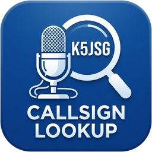

# Callsign Lookup

A Windows desktop tool that looks up an amateur radio callsign on [QRZ.com](https://www.qrz.com/) and works out, from the station's location:

- **6-character Maidenhead grid square** (e.g. `EM12kv`)
- **CQ zone** and **ITU zone**
- **County** and **state** (US; for Canadian stations the province)
- **ARRL/RAC section**
- **IOTA reference and island**, e.g. `AF-004 - Canary Islands` / `Alegranza`, or `EU-005 - Great Britain` / `Great Britain` for anywhere in England, Scotland or Wales

Each result is in its own read-only box: copy one with Ctrl+C or right-click → Copy, or all of them with **Copy All**. **Clear** empties the window. Tick **Stay on top** to keep the window above other programs (HRD Logbook, for instance); the choice is remembered.

The **Grid Square** box is the exception: if the grid on the QRZ record is wrong, paste or type the right one there, and every field is worked out again from the centre of that grid. Everything else, such as the DXCC entity and state, still comes from the QRZ record. A 6-character grid takes effect as soon as it's complete; press Enter for a 4-character one. Use 6 characters for islands, because the centre of a 4-character square is often out at sea.

If you log with HRD Logbook, it can also fill in the QSO you have open there: see [Filling in a QSO in HRD Logbook](#filling-in-a-qso-in-hrd-logbook).

Built by Jeremy S. Gaynor, K5JSG.

## Filling in a QSO in HRD Logbook

If you log with [Ham Radio Deluxe](https://www.hamradiodeluxe.com/) Logbook, Callsign Lookup can do the per-QSO cleanup in HRD's log entry window for you.

1. Open the QSO in HRD (Edit, or a new one in Add). Within a couple of seconds Callsign Lookup shows "*CALL* open" in its **HRD Logbook** row, puts the callsign in its box and looks it up. Opening another QSO, or changing or deleting the callsign in HRD, does the same.
2. Do HRD's own Lookup as usual.
3. Pick where you're operating from under **Working from**. These are HRD's My Station profiles (Tools > Configure > My Station). The choice is remembered.
4. Click **Fill HRD QSO**, and leave HRD alone until the report appears. In order, it:
   - checks name, QTH, state and US county against QRZ (for a POTA QSO the state and county are the park's instead), and fills any that are blank or don't match (a name with HRD's quoted nickname, `WILLIAM "Bill" HAMALAINEN`, matches);
   - takes POTA park references out of the Comment (`US-3033`, `POTA: US-4579 & US-4566`) and puts them in the POTA field in place of whatever was there, with the park's name and location from HRD's own park list. Several parks go in as a comma list, like HRD's "Multiple POTAs"; the first park is the one entered, so the POTA tab and the QSO get its name and location. This only happens when the Comment holds nothing but park references: a Comment with any other text is a real comment, so it's left alone and the report says so;
   - re-selects the My Station profile;
   - sets the QSO's location to the park (or, for no park, the QRZ location), and from that the grid square, CQ and ITU zones and ARRL section, worked out as in the main window;
   - clears the distance and presses HRD's Recalc (HRD measures grid square centre to grid square centre, from your My Station locator);
   - clears QSL Manager/VIA;
   - sets the IOTA reference and island if the location is on one.
5. The report lists every field that had a different value (to verify), every blank field it filled in, the My Station fields the profile changed, notes, and anything HRD wouldn't take. Then:
   - **Approve - Update in HRD** presses Update (F7) in HRD's window, saving the QSO;
   - **Close** leaves the QSO open in HRD, unsaved, to finish there. Cancel in HRD throws the changes away.

Only blank fields and ones that don't match are changed; a location within about 100 m of the right one is left alone. If QRZ's page for the callsign is for a different callsign (a portable or changed call), it asks before going on. An IOTA reference in HRD for a group nowhere near the location is cleared; one whose area the location is in (it could be a small island the island data hasn't got) is only flagged.

Callsign Lookup fills HRD's window through Windows UI Automation, the same interface screen readers use, so HRD needs no add-ons or settings. It only reads the description and callsign of your My Station profiles, not the passwords stored with them. Tested with HRD Logbook 6.9.

## How it works

1. The callsign is looked up through QRZ's [XML data service](https://www.qrz.com/docs/xml/current_spec.html) with your QRZ login.
2. The station's location is the lat/long on the QRZ record. If the record has no lat/long (lat/long needs a QRZ **XML Logbook Data subscription**), the center of the record's grid square is used, and the status bar says the location is approximate.
3. Everything else is computed **offline** from that location rather than taken from QRZ's own (user-entered) county/zone fields:
   - **Grid square**: standard Maidenhead math.
   - **County**: US stations only, going by the DXCC entity number on the QRZ record: United States (291) plus the separate entities that still have Census counties: Alaska (6), Hawaii (110), Puerto Rico (202), US Virgin Islands (285), Guam (103), American Samoa (9), Swains Island (515) and Mariana Islands (166). Other US possessions (Guantanamo Bay, Navassa, Wake, etc.) get no county. Point-in-polygon against US Census county boundaries (`Data/counties.json`, shared with POTA Activator Park Activations). A US point outside every county outline (just offshore, a barrier island, an approximate grid-square center in a lake) gets the nearest county in the state on its QRZ record. Stations anywhere else, Canada included, never get a county.
   - **CQ/ITU zone**: point-in-polygon against zone boundaries (`Data/cqZones.json`, `Data/ituZones.json`), simplified from HB9HIL's MIT-licensed [hamradio-zones-geojson](https://github.com/HB9HIL/hamradio-zones-geojson), the dataset behind [zone-check.eu](https://zone-check.eu/).
   - **ARRL section**: `Data/arrlSections.json`, from the [ARRL section boundaries](https://www.arrl.org/section-boundaries). Most states are one section. CA, FL, MA, NJ, NY, PA, TX and WA are split by county, so the county decides it. Canadian sections go by the province on the QRZ record. Ontario's four sections (GH/ONE/ONN/ONS) follow census divisions per [RAC's 2023 table](https://www.va3cco.com/ontariosections2023.pdf), so the station's division is looked up in `Data/ontarioDivisions.json` (Statistics Canada 2021 census divisions). Nipissing District is split: inside or south of Algonquin Park is ONE, the rest is ONN. The park outline comes from OpenStreetMap.
   - **IOTA**: the IOTA directory gives each group's DXCC entities, a rough bounding box and the names of the islands that count for it, but not where those islands are. So `Data/iotaIslands.json` holds the outline of every listed island, taken from OpenStreetMap and matched to the IOTA list by name. The station is on whichever island outline contains its location (or is within about 1 km of it), for a group whose box and DXCC entity fit, so the Island field is the island's name as IOTA lists it. IOTA often lists only a group's main islands, so the file also has the named islands within about 5 km of a listed one (e.g. Aunuʻu, off Tutuila, for OC-045). A station on one of those gets the group and the island's own name, with a note to check that it counts. Islands inside a listed island, such as those in Scottish lochs, are left out: they can't count for IOTA. A station that isn't on a listed island (the mainland, or an approximate location out at sea) gets the IOTA reference from its QRZ record if it has one, and the status bar says so. If the station is on an island but its QRZ record gives a different IOTA reference (say, an address and IOTA on Wallis but a grid square on Futuna), the location still decides, and the status bar warns that the two disagree. The IOTA list itself is downloaded from [iota-world.org](https://www.iota-world.org/) into `%LocalAppData%\Callsign Lookup\iota.json` and refreshed weekly, so new groups show up without an app update. Until the first download (or if it fails) the copy shipped in `Data/iota.json` is used. New islands in a downloaded list have no outline until the island data is rebuilt, so when IOTA has added any, a warning bar at the top of the window lists them and says the island data needs updating. `python Tools/build_iota_islands.py --update <cache dir>` does that in a few minutes: it rebuilds only the groups IOTA changed.

Your QRZ password is stored encrypted with Windows DPAPI (readable only by your Windows account on that PC) in `%LocalAppData%\Callsign Lookup\settings.json`.

Map data: Ontario census divisions © Statistics Canada ([Open Government Licence – Canada](https://open.canada.ca/en/open-government-licence-canada)); Algonquin Park and island outlines © [OpenStreetMap contributors](https://www.openstreetmap.org/copyright) (ODbL). IOTA directory from [Islands On The Air](https://www.iota-world.org/).

## Installation

Download the latest installer from the [Releases](https://github.com/K5JSG/Callsign-Lookup/releases) page and run it. The app is self-contained: no separate .NET runtime install is required. Installing a new version upgrades the existing copy in place: Installed apps keeps a single entry that shows the new version, the desktop and Start menu shortcuts stay where they are, and files the new version no longer uses are removed. Any other copy of the app installed separately (e.g. an older per-user install) is uninstalled. Your saved QRZ login is kept.

You'll need a [QRZ.com](https://www.qrz.com/) account. The first time the app runs it asks for your QRZ username and password.

## Building from source

Requirements: [.NET 10 SDK](https://dotnet.microsoft.com/download) (Windows) and, optionally, [Inno Setup](https://jrsoftware.org/isdl.php) to build the installer.

```powershell
dotnet build "Callsign Lookup.slnx"
dotnet test "Callsign Lookup.slnx"
```

To run the tests and produce a self-contained release build and installer:

```powershell
.\build.ps1 -Version <version>
```

This publishes a self-contained, single-file executable plus its `Data` folder to `publish\` and, if Inno Setup is installed, builds the installer into `dist\`.

## Project layout

| Path | What it is |
|------|------------|
| `MainForm.cs`, `QrzLoginForm.cs`, `HrdFillReportForm.cs` | The WinForms UI |
| `Services/Hrd/HrdQsoFiller.cs` | Works out what an HRD QSO needs and fills it in, in the order above |
| `Services/Hrd/HrdEditWindow.cs` | Reads and fills HRD Logbook's log entry window through UI Automation |
| `Services/Hrd/HrdPotaParks.cs`, `HrdStationProfiles.cs` | HRD's POTA park list and My Station profiles |
| `AppLogo.cs`, `logo.ico`, `logo-256.png` | Program icon and window logo, built into the exe (`Logo.png` is the full-size source artwork) |
| `Services/QrzService.cs` | QRZ XML client: login, session key reuse, re-login on timeout |
| `Services/CallsignLookupService.cs` | Callsign → location → grid/county/zones/section |
| `Services/Maidenhead.cs` | Grid square ↔ lat/long |
| `Services/CountyLookupService.cs` | Offline county lookup |
| `Services/ZoneLookupService.cs` | Offline CQ/ITU zone lookup |
| `Services/ArrlSectionService.cs` | ARRL/RAC section lookup |
| `Services/IotaService.cs` | Offline IOTA reference/island lookup, and the weekly IOTA list download |
| `Services/OntarioDivisionService.cs` | Offline Ontario census division lookup (for Ontario sections) |
| `Services/PolygonMath.cs` | Point-in-polygon and distance math shared by the lookups |
| `Data/` | Boundary and section data shipped next to the exe |
| `Tests/CallsignLookup.Tests` | xUnit tests (reference locations, QRZ response parsing, HRD fill planning) |
| `Installer/InnoSetup/` | Inno Setup installer script (built by `build.ps1`) |
| `Tools/build_ontario_divisions.py` | Regenerates `Data/ontarioDivisions.json` (instructions inside) |
| `Tools/build_iota_islands.py` | Regenerates `Data/iotaIslands.json` from OpenStreetMap: a full build, or `--update` for just the groups IOTA has changed (instructions inside) |

## License

GNU General Public License v3.0; see [License.txt](License.txt).
